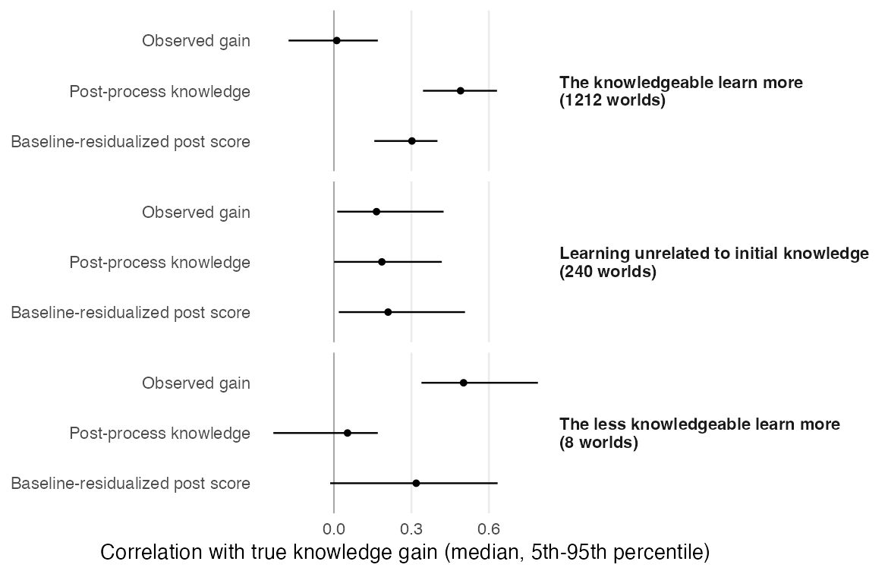

# Measuring Learning in Informative Processes

Robert C. Luskin, Ariel Helfer, and Gaurav Sood

How well does the gain in knowledge scores measure what people learn from campaigns and deliberative forums?

**[Read the manuscript](ms/main.pdf)** · [Editable source](ms/main.Rmd)

## Findings

- **Post-process knowledge can track learning when observed gain does not.** The general model guarantees nonnegative covariance under its monotonicity and independence assumptions, including conditional on true initial knowledge. Conditioning on noisy observed knowledge does not inherit that guarantee.
- **In the retained proportional-learning simulations**, observed gain's median correlation with true learning is about .01 and post-process knowledge's about .49. The filter retains 1,212 proportional, 240 additive and eight catch-up worlds out of 4,000 of each. These counts depend on the simulation grid; they do not rule out catch-up learning. [Simulations](tabs/simulations.csv)
- **Education comparisons depend on adjustment.** For participants above their poll's education median, the pooled observed-gain difference is .017 [−.005, .041]; the post-process difference controlling for baseline is .066 [.049, .085]. These are associations with observed scores, with 95% posterior intervals. [Estimates](tabs/who_learns.csv)
- **Attitude associations depend on the proxy.** Across 129 indices, observed gain has positive coefficients on 50%, post-process knowledge on 59%, and post-process knowledge controlling for baseline on 53%. These descriptive summaries do not establish an absence of learning effects. [Summary](tabs/attitudes_summary.csv)
- **The candidate estimator is conditional mean gain given both waves' item responses.** A joint IRT implementation estimates item parameters and the learning distribution, then integrates gain over each person's posterior. A separate simulation study evaluates it on new respondents. Its gains depend on the learning model, item difficulty range, and measurement invariance; the comparison reports failures as well as successes. The empirical polls remain comparisons of observed scores; the joint IRT model is not yet fitted to those polls.



## Data

Participant-level knowledge scores and attitude indices for 21 Deliberative Polls come from the corrected [dp-data](https://github.com/soodoku/dp-data) export, pinned to commit `f88da7fa904cde55044dd3dda9fd337ca26cb8bd`. The two bundled inputs are checked by SHA-256 on every analysis run. [Data and snapshot instructions](data/README.md) describe the fixed within-poll median education rule.

## Reproduce

R packages are pinned in `renv.lock`; the paper also needs Pandoc and XeLaTeX.

```sh
make restore
make check
```

`make check` runs the simulations and analyses, draws the figures, renders the manuscript, and runs linting and tests. It uses the bundled snapshot and does not require a sibling checkout or network access after dependencies are installed. `make ci-docker` runs the same checks in the standard Rocker R image.

The joint IRT comparison uses 80 training/test replications across eight scenarios. Its generated results are rebuilt when the model, comparison code, or lockfile changes. Run `IRT_CORES=3 make -B estimation` to force a full rerun with three worker processes on macOS or Linux. Each fit uses 300 training respondents; predictions are evaluated on 1,000 independent respondents. The positive knowledge trait is `exp(theta)`, with the baseline log-trait mean fixed at zero and variance at one. It is not a proportion of all knowable facts. Guessing probabilities are supplied by the simulation design; item slopes, intercepts, and change-distribution parameters are estimated. Posterior intervals condition on those fitted parameters.

To score new respondents with the fitted model:

```r
source("R/irt.R")
model <- fit_joint_irt(training_pre, training_post, guess = item_guess)
stopifnot(model$converged, length(model$warnings) == 0)
gain <- posterior_irt_learning(model, new_pre, new_post)
```

Each response matrix has one row per respondent and one column per matched item, coded 0/1 with missing responses as `NA`. Rows must identify the same respondents across waves, and item columns must have the same order in training and scoring. `item_guess` supplies known guessing probabilities. The returned `estimate`, `lower`, and `upper` describe gain on the positive-trait scale; the limits condition on the fitted parameters. They are not percentages of topic-wide knowledge.

`make snapshot` reconstructs the pinned inputs from `../dp-data` without changing that checkout. Set `DP_DATA_ROOT` to use another local clone. Changing the upstream revision requires reviewing new checksums and regenerating the analyses.

## Layout

| Folder | Contents |
|---|---|
| `data/raw/`, `data/sources.csv` | Pinned upstream inputs and SHA-256 manifest |
| `R/` | Simulation and joint IRT models, estimator comparisons, attitude and education analyses, figure style |
| `scripts/` | Analyses, figures and pinned input snapshot |
| `tabs/`, `figs/` | Generated tables and figures |
| `ms/` | Manuscript source, bibliography and PDF |
| `tests/` | Checks on the model and the outputs |
